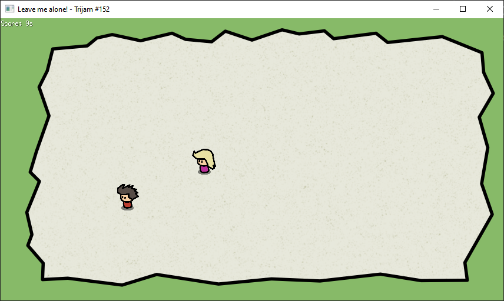
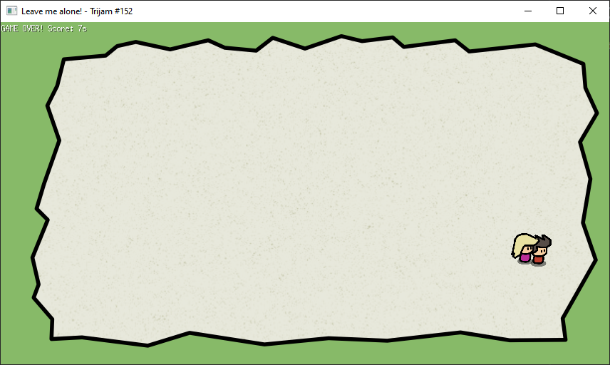

# ebiten-leave-me-alone-trijam

Game created for Trijam #152 while testing the Ebiten game development engine in Go.

The game jam theme was: **Leave Me Alone**. In this simple game, you have to run as long as you can avoiding getting
caught.

Controls: Arrows to move, hold left shift to run






### License

```
MIT
```